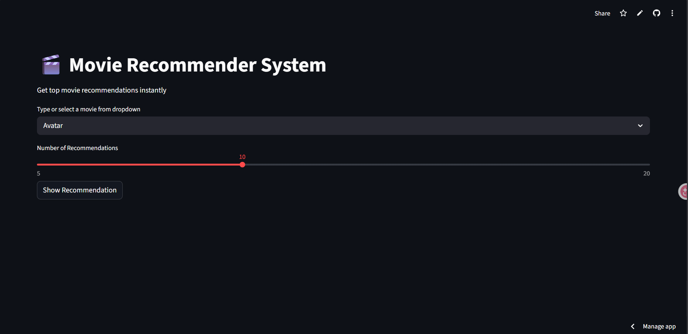
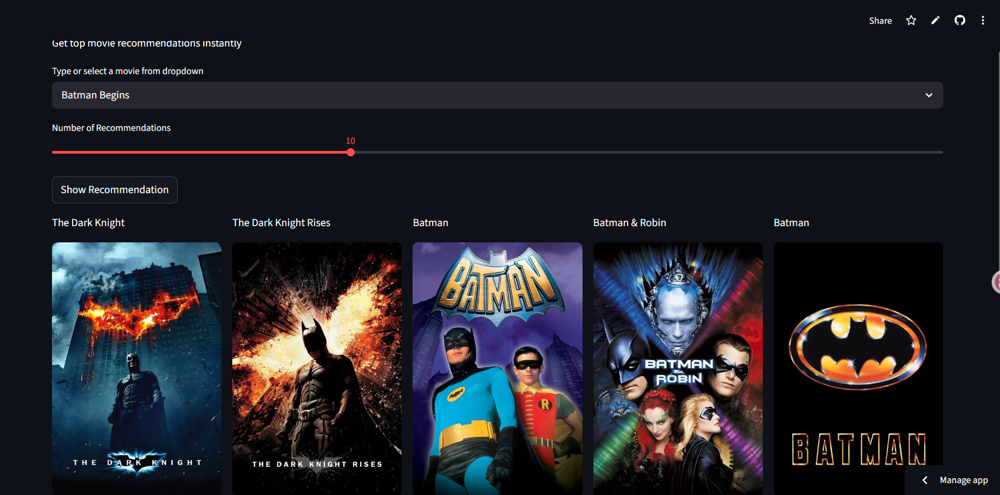

# 🎬 Movie Recommender System

A Content-Based Movie Recommendation System built using Machine Learning and Streamlit that recommends similar movies based on user selection.

## 🚀 Features

* Movie recommendations based on content similarity
* Interactive web interface using Streamlit
* Adjustable number of recommendations
* Real-time movie poster fetching using TMDB API
* Fast recommendation generation

## 🛠️ Tech Stack

* Python
* Pandas
* NumPy
* Scikit-Learn
* Streamlit
* TMDB API

## 📂 Project Structure

```text
movie-recommender-system/
│
├── app.py
├── requirements.txt
├── Procfile
├── setup.sh
├── README.md
│
├── data/
│   ├── movies.pkl
│   ├── similarity.pkl
│   ├── tmdb_5000_movies.csv
│   └── tmdb_5000_credits.csv
│
├── notebooks/
│   └── movie_recommendation_system.ipynb
│
├── screenshots/
├── assets/
└── docs/
```

## Screenshots

### Home Page


### Recommendations


## ⚙️ Installation

Clone the repository:

```bash
git clone https://github.com/yourusername/movie-recommender-system.git
```

Install dependencies:

```bash
pip install -r requirements.txt
```

Run the application:

```bash
streamlit run app.py
```

## 📊 How It Works

1. Data preprocessing and cleaning
2. Feature engineering using movie metadata
3. Content vectorization using CountVectorizer
4. Similarity calculation using Cosine Similarity
5. Recommendation generation based on similarity scores
6. Poster retrieval using TMDB API

## 🔮 Future Improvements

* Collaborative Filtering
* Hybrid Recommendation System
* User Authentication
* Personalized Recommendations
* Movie Search Optimization

## 👨‍💻 Author

Nitin Patel
B.Tech CSE (AI & ML)
